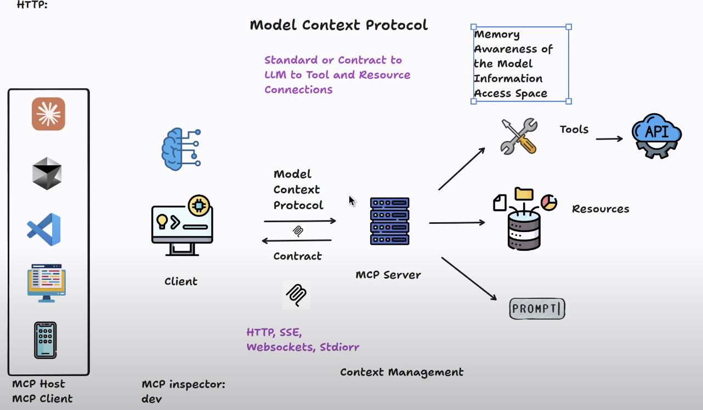
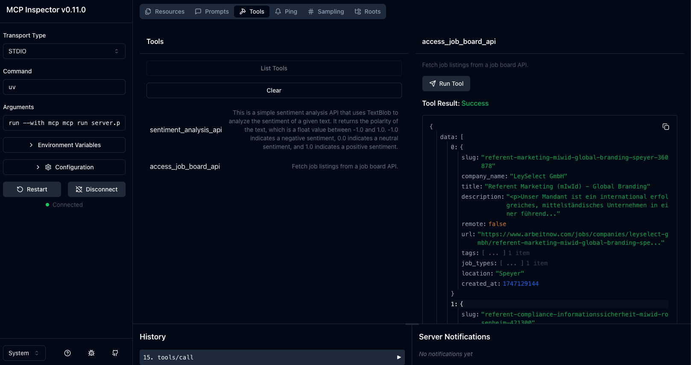
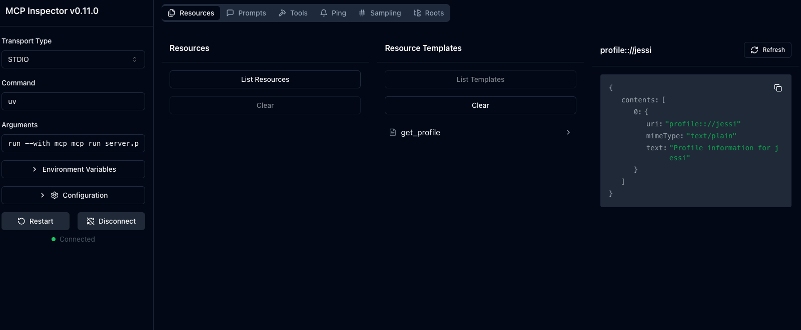
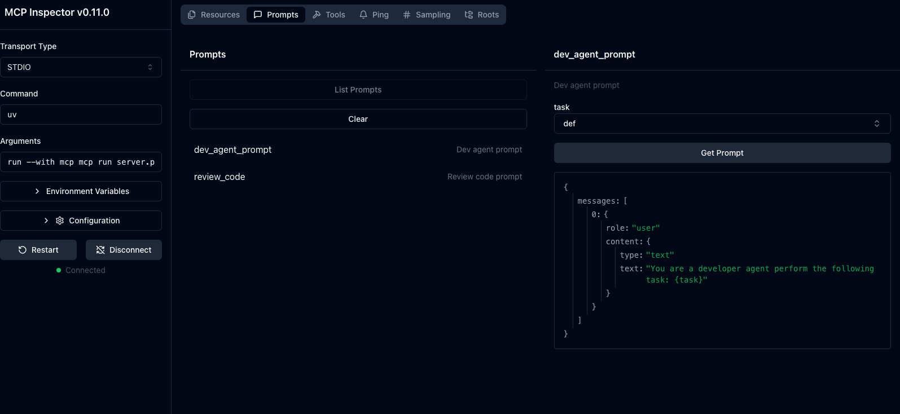

# MCP Project: Using MCP Server to Enhance AI Context Window

This project demonstrates how to implement an [MCP (Model Context Protocol)](https://github.com/modelcontextprotocol/python-sdk) server in Python using tools, prompts, and resources to enrich the context window of an AI agent like GitHub Copilot Labs.

---

## 🧠 What Is This?

A fully working MCP backend that:
- ✅ Exposes **tools** (live API functions)
- ✅ Serves **resources** (structured memory like user profiles)
- ✅ Provides **prompts** (templates to shape agent behavior)

Designed to integrate directly with **GitHub Copilot Labs** or **any MCP-compatible client**.

## What you have to know

This figure is a simplified version of the MCP architecture.


---

## 🔁 Workflow Overview

1. Define your tools, prompts, and resources in `server.py`.
2. Start the MCP server.
3. Launch VSCode with Copilot Labs and connect to your server using `mcp.json`.
4. Use tools/resources/prompts right inside your chat agent.

---

## 🛠️ Tools

Tools are dynamic APIs that can be called from within the agent.



---

## 📦 Resources

Resources provide context like profiles, docs, knowledge snippets.



---

## ✨ Prompts

Prompts are templates used by the agent to condition its behavior.



---

## 🚀 Setup & Running

### 1. Clone and install dependencies

```bash
git clone https://github.com/YOUR_USERNAME/MCP_Project.git
cd MCP_Project
python3 -m venv venv_fahmi
source venv_fahmi/bin/activate
pip install mcp textblob requests
python -m textblob.download_corpora
````

### 2. Run your MCP server

```bash
python server.py
```

You should see a message like:

```
MCP server is running at http://127.0.0.1:6274
```

---

## 🧪 Testing in GitHub Copilot (VSCode)

### 1. Install [Copilot Labs Extension](https://marketplace.visualstudio.com/items?itemName=GitHub.copilot-labs)

### 2. Add an MCP config in VSCode

Create `.vscode/mcp.json` with the following content:

```json
{
  "servers": {
    "my-mcp-server": {
      "type": "stdio",
      "command": "python3",
      "args": [
        "/Users/your_username/Desktop/MCP_Workspace/MCP_Project/server.py"
      ]
    }
  }
}
```

> ✅ Make sure the path is correct to your `server.py`.

### 3. Start MCP Server

From terminal:

```bash
source venv_fahmi/bin/activate
python server.py
```

> You should see logs confirming the server is active.

---

## 🧠 Example Use Cases

* Ask the agent:
  *“Use the `sentiment_analysis_api` tool to check if the text ‘I’m so excited to code’ is positive.”*

* Or test the job board fetch:
  *“Use the `access_job_board_api` to get the latest jobs.”*

---

## 📁 Project Structure

```
MCP_Workspace/
├── MCP_Project/
│   ├── image/
│   │   ├── example-tool.png
│   │   ├── example-resource.png
│   │   └── example-prompt.png
│   ├── server.py
├── .vscode/
│   └── mcp.json
├── venv_fahmi/
└── README.md
```

---

## 🔗 References

* [MCP Python SDK](https://github.com/modelcontextprotocol/python-sdk)
* [MCP Intro Video](https://www.youtube.com/watch?v=MjfaTE3apao)


